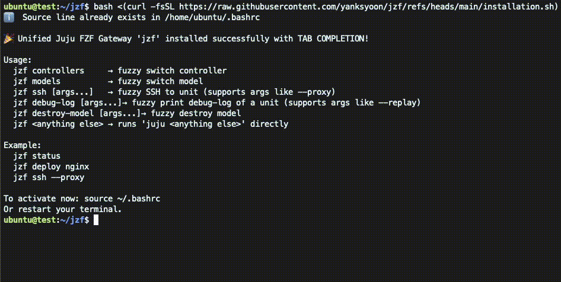

# Fuzzy Finder (FZF) enhancemendt to Juju (JZF)

JZF (Juju Fuzzy Finder) is a bash script to enhance interaction with Juju CLI, especially with
interactions with list of items including:
- Controllers
- Models
- Units
- Applications
and so on.

## Installation

`bash <(curl -fsSL https://raw.githubusercontent.com/yanksyoon/jzf/refs/heads/main/installation.sh)`

Running the above would install `.juju-fzf-unified.bash` in the home directory which contains the
function `jzf`.

## Usage

```
  jzf controllers     → fuzzy switch controller
  jzf models          → fuzzy switch model
  jzf ssh [args...]   → fuzzy SSH to unit (supports args like --proxy)
  jzf debug-log [args...]→ fuzzy print debug-log of a unit (supports args like --replay)
  jzf <anything else> → runs 'juju <anything else>' directly
```

Example:

```
  jzf status
  jzf deploy nginx
  jzf ssh --proxy
```

## Demo

### DEMO


### SPEED


